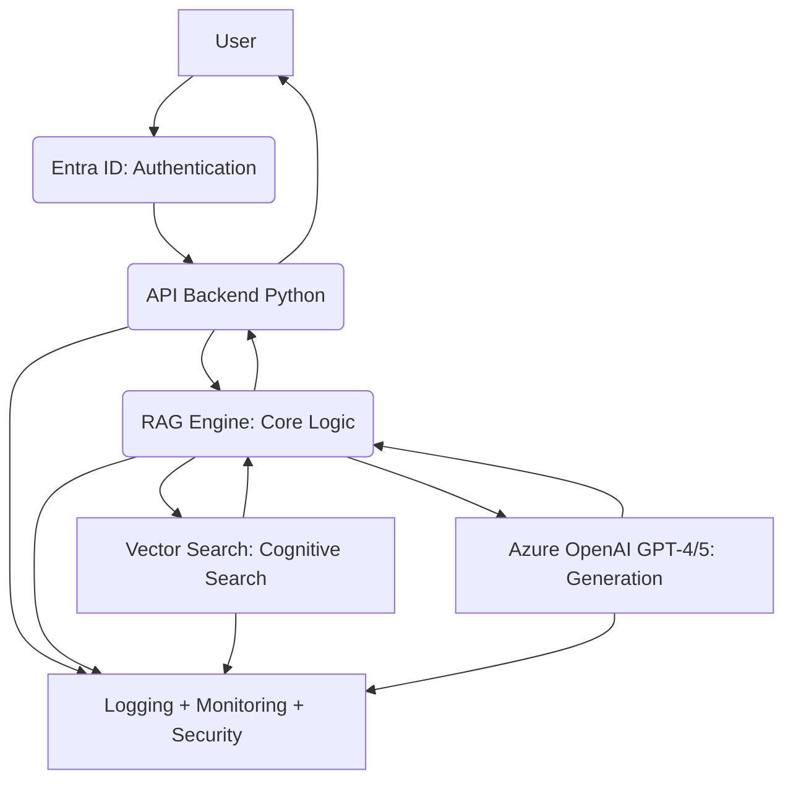

# 🚀 Enterprise RAG Architecture – Azure OpenAI + Cognitive Search + Security

**Author:** Stefano Giacchi  
**Role:** Cloud Architect • AI Engineer • Security-Oriented Enterprise Architect

---

## 📌 Overview: Secure RAG System

This repository contains a complete, scalable, and secure architecture for deploying an **Enterprise RAG (Retrieval Augmented Generation)** system.

The solution is built using core Azure services:
* **Azure OpenAI (GPT-4/5)**
* **Azure Cognitive Search / Vector Index**
* **Azure Storage + Data Lake**
* **Python API Layer**
* **Enterprise Security (Entra ID, Zero Trust, RBAC)**

The main goal is to provide an **enterprise-ready reference architecture** for large-scale AI solutions, focusing on:
* **Security**
* **Governance**
* **Auditability**
* **Performance**
* **Modularity**

---

## 🧠 Architecture Diagram (High-Level Flow)

This shows the secure path for an AI query.

---

## 🔥 Features

### ✔️ Complete RAG Pipeline
* **Data Ingestion:** Securely loading data.
* **Chunking & Embedding:** Processing data via Azure OpenAI embedding models.
* **Indexing:** Storing vectors in the Cognitive Search Vector Index.
* **Querying:** Using **hybrid search** (semantic + vector) for high accuracy.

### ✔️ Python API Backend
* Built with FastAPI / Flask.
* Includes **Rate Limiting** and **Retry Policies**.
* Structured logging for easy debugging.
* **OpenTelemetry** for application monitoring.

### ✔️ Security Implementation
* **Entra ID (OAuth2):** Strong user authentication.
* **Key Vault:** Secure storage for all secrets.
* **Private Endpoints:** Isolates the RAG services from public internet.
* **Zero Trust:** Network segmentation and least privilege access.
* **Responsible AI Policies:** Enforcing content safety and fairness.

### ✔️ Deployment & Infrastructure (IaC)
* **Bicep/Terraform** templates for repeatable deployments.
* **Azure DevOps pipelines** for automated CI/CD.
* Centralized logging (Azure Monitor + Log Analytics).
* Dashboards with key AI usage and performance metrics.

---

## 📂 Repository Structure

| Folder | Purpose |
| :--- | :--- |
| `/architecture` | Design documents and decisions. |
| `/src` | All application code (API, RAG engine logic, utilities). |
| `/deploy` | Infrastructure as Code (IaC) files and pipelines. |
| `/docs` | Detailed guides and documentation. |

### Key Sub-folders
* `/src/api`
* `/src/rag-engine`
* `/deploy/bicep`
* `/deploy/terraform`
* `/docs/SECURITY-MODEL.md`

---

## ✨ Use Cases

This secure architecture is ideal for:
* Industrial **Document Intelligence** (e.g., Fincantieri, Eni).
* Public Administration (PA) **Digitalization** (e.g., Sogei).
* Creating a highly secure **Knowledge Assistant**.
* Building an intelligent, internal **Helpdesk** system.
* Core RAG engine for any large-scale enterprise application.

---

## 📜 License

Open Source – For educational and reference purposes.

---

## 💼 Author

**Stefano Giacchi** Cloud Architect • AI Architect • Security Specialist
